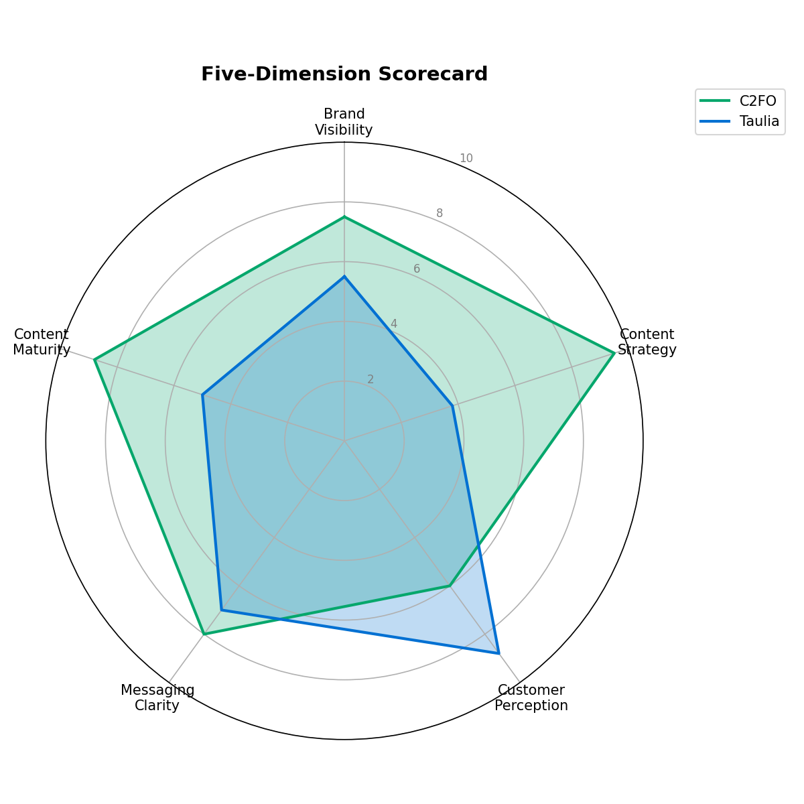

# Competitive Marketing Audit: SAP Taulia vs C2FO

*A data-driven competitive intelligence project analysing marketing strategy, customer perception, and market positioning across six data sources.*

---

## 1. The Business Question

**How does SAP Taulia's marketing presence compare to its primary competitor C2FO, and where are the opportunities for Taulia to gain competitive advantage?**

Taulia and C2FO compete for the same buyer: enterprise finance leaders looking to unlock working capital through supply chain finance, dynamic discounting, and early-payment programmes. Both companies sell a similar promise; the differentiator is how that promise is communicated, amplified, and validated in market.

This audit moves past surface-level brand impressions and quantifies the gap. It answers a strategic question marketing leadership at Taulia should care about — not "are we present in the category," but "where are we winning, where are we ceding ground, and where would investment compound fastest?"

---

## 2. Methodology

The audit triangulates evidence from six independent data sources to avoid the single-channel bias that distorts most competitive scans:

- **Social media metrics** — LinkedIn, X/Twitter, and YouTube follower counts, posting cadence, content mix, and engagement
- **Customer reviews** — G2 and Capterra ratings with thematic analysis of qualitative review text (sentiment, recurring themes, paraphrased voice-of-customer)
- **Google Trends** — branded search interest comparison, weekly over the trailing 12 months, plus regional breakdown
- **Website positioning and messaging audit** — homepage H1, meta descriptions, primary CTAs, and navigation taxonomy
- **SEO traffic and engagement estimates** — monthly visits, bounce rate, visit duration, pages per visit, organic vs paid split, ranking keyword count, geographic distribution
- **Content marketing ecosystem coverage** — presence/absence across eight content categories (blog, newsroom, resources, case studies, webinars, podcast, events, glossary)

Each company was then scored 1–10 across **five composite dimensions**: Brand Visibility, Content Strategy, Customer Perception, Messaging Clarity, and Content Maturity. Scores are derived from the underlying metrics rather than asserted, so every number can be traced back to source data in the CSVs.

**Tools:** Python, Pandas, Matplotlib, BeautifulSoup, ReportLab, Google Trends API (pytrends).

The project demonstrates both the analytical thinking required of a marketing strategist (defining a comparative framework, building a defensible scoring methodology, isolating signal from noise) and the technical execution needed to run that work at scale (automated scraping, structured data pipelines, reproducible chart generation, programmatic PDF assembly).

---

## 3. Key Findings



**1. Taulia wins where the buyer is already engaged — and loses where they aren't yet looking.**
Taulia's website pulls **~304K monthly visits to C2FO's 76.8K** (4× more traffic), with visitors staying **2.4× longer** (5:06 vs 2:09), viewing more pages per session, and a lower bounce rate. Taulia ranks for **~2,400 keywords vs C2FO's 463**. Once buyers arrive, Taulia's depth and product story hold attention — the on-site experience is the stronger of the two.

**2. The discovery funnel above that engagement is effectively switched off.**
C2FO posts **3.35×/week across social** and scores **74.4 average Google Trends interest**; Taulia posts **0.5×/week** and scores **11.8** — roughly a sixth of C2FO's branded search demand. LinkedIn (26,977 followers) has had **zero posts in the trailing four weeks**; the last X/Twitter post was June 2024. C2FO also operates a blog, newsroom, and podcast that Taulia does not. The result is a **Content Strategy score of 9.5 vs 3.8** in C2FO's favour.

**3. Customer perception is decisively in Taulia's favour — and underleveraged.**
Taulia carries a **4.55 weighted review rating across 12 reviews** (including 4.8 on Capterra) versus C2FO's single G2 review. Thematic analysis surfaces consistent strengths in ease of use, supplier experience, and dynamic discounting value. The **Customer Perception score is 8.8 vs 6.0** for Taulia — but this advantage is not being amplified in homepage messaging, social proof, or content.

**Strategic implication for Taulia:** the product is winning where it can be measured directly. The audit gap is a *marketing surface-area* problem, not a *product* problem — and that is the cheaper of the two problems to solve.

---

## 4. Strategic Recommendations

1. **Reactivate the dormant social estate, starting with LinkedIn.** Taulia has 26,977 LinkedIn followers and zero posts in the trailing four weeks; restoring even a baseline cadence captures share-of-voice that C2FO is currently winning by default at 1.75 LinkedIn posts/week.

2. **Close the top-of-funnel content gap with a blog, newsroom, and podcast.** These are the three content categories C2FO operates and Taulia does not — and Taulia's superior on-site engagement (5:06 visit duration, 4.33 pages/visit) means new top-of-funnel discovery would compound against an already-converting site.

3. **Make customer voice a homepage-level asset, not a hidden one.** Taulia's 4.55 weighted rating and 12 substantive reviews vs C2FO's single review are a category-defining advantage; commission a structured G2/Capterra review programme and surface Capterra's 4.8 rating directly in headline messaging and CTAs.

---

## 5. Project Outputs

- **Professional PDF audit report** — `Taulia_vs_C2FO_Marketing_Audit.pdf`
- **Comparative analysis across 7 structured CSV datasets** covering social, reviews, search trends, SEO, messaging, and content ecosystem
- **4 data visualisations** — radar comparison, dimension-by-dimension bar comparison, sentiment breakdown, and review theme distribution
- **Automated data collection and analysis scripts** — `auto_collect.py` for sourcing, `marketing_audit.py` for analysis and PDF generation

---

## 6. How to Run

```bash
# 1. Install dependencies
pip install pandas matplotlib beautifulsoup4 requests reportlab pytrends --break-system-packages

# 2. Run data collection
python auto_collect.py

# 3. Run analysis and generate PDF
python marketing_audit.py
```
